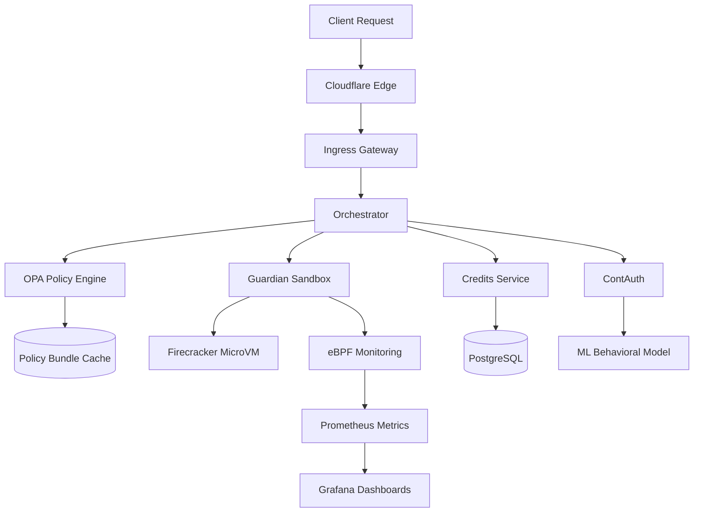

<div align="center">

# 🛡️ ShieldX - AI-Powered Cloud Security Platform

**Next-generation cloud security combining AI/ML threat detection, deception technology, and sandbox isolation**

[](./.github/workflows/ci.yml)
[](./.github/workflows/security.yml)
[](./.github/workflows/supply-chain.yml)
[](./.github/workflows/policy.yml)
[](LICENSE)
[](https://go.dev/)

</div>

> Status: **ALPHA / EXPERIMENTAL** – Not yet production hardened. See [SECURITY.md](SECURITY.md) for deployment guidelines.

---

## ✨ Overview

ShieldX is an advanced cloud security platform that protects web applications and APIs from sophisticated cyber attacks through:

### 🔒 Core Capabilities

* **AI/ML Threat Detection** - Real-time anomaly detection using behavioral analysis
* **Deception Technology** - Dynamic honeypots and adaptive server fingerprint camouflage
* **Sandbox Isolation** - Secure code execution in Firecracker MicroVMs with eBPF monitoring
* **Continuous Authentication** - Behavioral biometrics (keystroke dynamics, mouse patterns)
* **Policy Orchestration** - OPA-based routing with cryptographic bundle integrity
* **Zero-Trust Architecture** - Risk-based access control with device fingerprinting

### 🎯 Use Cases

* **Web Application Firewall (WAF)** - Advanced threat protection beyond signatures
* **API Security Gateway** - Rate limiting, authentication, and threat analysis
* **Malware Analysis** - Safe execution and forensic analysis in isolated sandboxes
* **Fraud Prevention** - Continuous user authentication based on behavioral patterns
* **Compliance** - SOC 2, ISO 27001, GDPR, PCI DSS audit trails

## 🧩 High-Level Architecture

### System Components

| Component | Port | Technology | Purpose |
|-----------|------|------------|---------|
| **Orchestrator** | 8080 | Go, OPA | Central routing & policy evaluation |
| **Ingress** | 8081 | Go, QUIC | Traffic gateway & rate limiting |
| **Guardian** | 9090 | Go, Firecracker, eBPF | Sandbox execution & threat analysis |
| **Credits** | 5004 | Go, PostgreSQL | Resource management & billing |
| **ContAuth** | 5002 | Go, Python ML | Continuous authentication |
| **Shadow** | 5005 | Go, Docker | Safe rule testing environment |
| **Policy Rollout** | 5006 | Go | Controlled policy bundle promotion |
| **Verifier Pool** | 5007 | Go | Attestation & integrity verification |
| **Locator** | 5008 | Go, Consul | Service discovery |

### Data Flow



**See `docs/ARCHITECTURE.md` for detailed component interactions.**

## � Request Processing Flow

```
1. Client Request → Edge Worker (Cloudflare)
2. Edge Worker → Camouflage API (Template selection)
3. Request → Ingress Service (Rate limiting, filtering)
4. Ingress → Orchestrator (Policy evaluation via OPA)
5. Orchestrator → Guardian (Sandbox analysis if suspicious)
6. Guardian → ML Pipeline (Threat scoring)
7. Response ← Orchestrator (Decision routing)
8. Response ← Ingress (Apply deception if needed)
9. Client ← Edge Worker (Camouflaged response)
```

## 🔐 Security & Trust Model

### Defense Layers

* **Deception Technology** - Camouflage engine disguises server fingerprints, dynamic decoys trap attackers
* **Sandbox Isolation** - Firecracker MicroVMs provide hardware-level isolation for untrusted code
* **Zero-Trust Network** - Every request verified, mTLS between services, RBAC enforcement
* **Cryptographic Integrity** - Policy bundles signed with cosign (keyless), immutable audit logs
* **Continuous Authentication** - Behavioral biometrics validate user identity throughout session

### Compliance

✅ **SOC 2 Type II** - Security controls and audit trails  
✅ **ISO 27001** - Information security management  
✅ **GDPR** - Data protection and privacy  
✅ **PCI DSS** - Payment card industry security  

See [`SECURITY.md`](SECURITY.md) & [`docs/THREAT_MODEL.md`](docs/THREAT_MODEL.md) for details.

## � API Examples

### Credits Service
```bash
# Check balance
curl http://localhost:5004/credits/balance/tenant-123

# Consume credits
curl -X POST http://localhost:5004/credits/consume \
  -H "Content-Type: application/json" \
  -d '{"tenant_id":"org-123","amount":100,"description":"API call"}'
```

### Continuous Authentication
```bash
# Collect behavioral telemetry
curl -X POST http://localhost:5002/contauth/collect \
  -d '{"session_id":"sess-456","keystroke_data":{...}}'

# Get risk score
curl -X POST http://localhost:5002/contauth/score \
  -d '{"session_id":"sess-456"}'
```

### Orchestrator
```bash
# Health check
curl http://localhost:8080/health

# Get routing policy
curl http://localhost:8080/policy

# Prometheus metrics
curl http://localhost:8080/metrics
```

## �🚀 Quick Start

### Prerequisites

- Go 1.25+
- Docker 24.0+
- Docker Compose 2.20+
- Make
- 8GB+ RAM (for Firecracker VMs)

### Local Development

```bash
# Clone repository
git clone https://github.com/shieldx-bot/shieldx.git
cd shieldx

# Install dependencies
go mod download

# Build all services
make build

# Start full stack (PostgreSQL, Redis, all services)
docker compose -f docker-compose.full.yml up -d

# Verify services
docker ps --filter name=shieldx
```

Check services:
```bash
docker ps --filter name=shieldx
```

Run tests + lint:
```bash
make test
make lint
```

## 🧪 Development Workflow

* Create branch: `git checkout -b feat/my-feature`
* Write code + tests (≥70% coverage for changed files target)
* Run `make fmt lint test`
* Update `CHANGELOG.md` if user-visible change
* Open PR (template will guide details)

## 🏗 Project Layout (excerpt)

```
cmd/               # Binaries entrypoints
core/              # Core engines (policy, sandbox orchestration, scoring)
guardian/          # Guardian service
ingress/           # API / edge ingress
policy-rollout/    # Controlled policy promotion service
verifier-pool/     # Attestation & verification logic
docs/              # Architecture, roadmap, threat model, etc.
```

## 🛡 Policy Bundles

Policies are compiled & signed in Policy CI. Promotion workflow signs digest & (optionally) triggers rollout. Tooling: `cmd/policyctl`.

## 🧪 Testing Matrix

| Layer | Tools | Notes |
|-------|-------|-------|
| Unit | `go test -race` | Core correctness |
| Policy | `opa test` | Rego unit tests |
| Integration | Compose scripts | Multi-service flows |
| Security | `gosec`, `govulncheck` | Security workflow |
| Supply Chain | Syft, cosign | SBOM + signing |

## 📦 Supply Chain

* SBOM (Syft) for source + images
* Snapshot builds (GoReleaser) on main
* Optional container image signing (cosign keyless)

## 🗺 Roadmap

See `docs/ROADMAP.md` for planned phases & milestones.

## 📊 Monitoring & Observability

### Prometheus Metrics

Key metrics exported by services:

```
shieldx_requests_total              - Total requests processed
shieldx_threats_blocked             - Threats detected and blocked
shieldx_sandbox_executions          - Sandbox analysis runs
shieldx_credits_consumed            - Resource usage tracking
shieldx_auth_risk_score             - Authentication risk levels
http_request_duration_seconds       - Request latency histogram
```

### Grafana Dashboards

Pre-built dashboards available:

- **System Overview** - Service health, throughput, error rates
- **Security Metrics** - Threats blocked, attack patterns, risk scores
- **Performance Monitoring** - Latency, cache hit rates, resource usage
- **Business KPIs** - Credit consumption, active tenants, API usage

### Health Checks

```bash
# Check all services
make health

# Individual service health
curl http://localhost:8080/health  # Orchestrator
curl http://localhost:8081/health  # Ingress
curl http://localhost:9090/health  # Guardian
```

## 🔧 Troubleshooting

### Common Issues

**Service Unavailable (503)**
```bash
# Check service status
docker logs shieldx-orchestrator
docker logs shieldx-ingress

# Verify database connectivity
psql -h localhost -p 5432 -U credits_user -d credits

# Check Redis
redis-cli -h localhost -p 6379 PING
```

**High Latency**
```bash
# Check metrics
curl http://localhost:8080/metrics | grep duration

# Review cache hit rates
redis-cli INFO stats | grep hit_rate

# Monitor database connections
psql -c "SELECT count(*) FROM pg_stat_activity;"
```

**Authentication Failures**
```bash
# Check ContAuth logs
docker logs shieldx-contauth

# Verify ML model status
curl http://localhost:5002/health

# Review risk scores
psql -d contauth -c "SELECT * FROM risk_scores ORDER BY timestamp DESC LIMIT 10;"
```

See full troubleshooting guide: `docs/TROUBLESHOOTING.md`

## 🤝 Contributing

We welcome contributions! Please read [`CONTRIBUTING.md`](CONTRIBUTING.md) for:

- Code of conduct
- Development setup
- Testing requirements
- Pull request process
- Coding standards

Follow **Conventional Commits** format and update [`CHANGELOG.md`](CHANGELOG.md) for user-facing changes.

## 📣 Governance & Maintainers

Decision process, roles & escalation in `GOVERNANCE.md`. Current maintainers listed in `MAINTAINERS.md`.

## 🔒 Security

See `SECURITY.md` for reporting & hardening. DO NOT file public issues for vulnerabilities.

## 🧾 License

Apache 2.0 – see `LICENSE`.

## � Support & Community

- **Documentation**: [https://docs.shieldx.dev](https://docs.shieldx.dev)
- **Issues**: [GitHub Issues](https://github.com/shieldx-bot/shieldx/issues)
- **Discussions**: [GitHub Discussions](https://github.com/shieldx-bot/shieldx/discussions)
- **Security**: security@shieldx-project.org (private disclosure)
- **Email**: support@shieldx.dev

## �🙏 Acknowledgements

ShieldX builds upon excellent open source projects:

- **[Open Policy Agent (OPA)](https://www.openpolicyagent.org/)** - Policy engine
- **[Firecracker](https://firecracker-microvm.github.io/)** - MicroVM technology
- **[Cloudflare Workers](https://workers.cloudflare.com/)** - Edge computing
- **[eBPF](https://ebpf.io/)** - Kernel-level monitoring
- **[Prometheus](https://prometheus.io/)** & **[Grafana](https://grafana.com/)** - Observability
- Kubernetes SIG-Security patterns and supply chain security best practices

## 📄 License

Apache License 2.0 - see [`LICENSE`](LICENSE) for details.

Copyright © 2025 ShieldX Contributors

---

<div align="center">

**Ready to secure your cloud?**

[Get Started](docs/QUICKSTART.md) · [Documentation](docs/ARCHITECTURE.md) · [API Reference](docs/API.md) · [Examples](examples/)

</div>
