```mermaid
graph LR
    Client["👨💻<br/>Client"] --> Ingress["🚪<br/>Ingress Gateway<br/>Port 8081"]
    Ingress --> Orchestrator["🧠<br/>Orchestrator<br/>Port 8080"]

    Orchestrator --> Guardian["🛡️<br/>Guardian<br/>Port 9090"]
    Guardian --> Firecracker["🔥<br/>Firecracker + eBPF"]
    Firecracker --> Guardian

    Orchestrator --> ContAuth["👤<br/>ContAuth<br/>Port 5002"]
    Orchestrator --> OPAPolicy["📜<br/>OPA Engine"]
    Orchestrator --> Credits["💳<br/>Credits<br/>Port 5004"]

    Guardian --> Orchestrator
    ContAuth --> Orchestrator
    OPAPolicy --> Orchestrator
    Credits --> Orchestrator

    Orchestrator --> Decision{"⚖️<br/>Risk Score"}
    Decision -->|"✅ Safe"| Upstream["🌐<br/>Upstream App"]
    Decision -->|"⚠️ Suspicious"| MFA["🔐<br/>MFA Challenge"]
    Decision -->|"❌ Dangerous"| Block["🚫<br/>Block & Log"]

    MFA --> Upstream

    Orchestrator -.-> Locator["🔍<br/>Locator<br/>Port 5008"]
    Orchestrator -.-> Shadow["🎭<br/>Shadow<br/>Port 5005"]
```

<!-- ALL-CONTRIBUTORS-BADGE:START - Do not remove or modify this section -->
[](#contributors-)
<!-- ALL-CONTRIBUTORS-BADGE:END -->
-----

<div \>


# 🛡️ ShieldX - AI-Powered Cloud Security Platform

**Next-generation cloud security combining AI/ML threat detection, deception technology, and sandbox isolation.**

[](./.github/workflows/ci.yml)
[](./.github/workflows/security.yml)
[](LICENSE)
[](https://go.dev/)
[](CONTRIBUTING.md)

[Documentation](https://www.google.com/search?q=docs/) · [Architecture](https://www.google.com/search?q=docs/ARCHITECTURE.md) · [API Reference](https://www.google.com/search?q=docs/API.md) · [Report an Issue](https://www.google.com/search?q=https://github.com/shieldx-bot/shieldx/issues)

> **Status**: 🧪 ALPHA / EXPERIMENTAL – This project is under active development and is not yet production-ready. We welcome contributions to help us move forward\!

                     
-----
 ##                                                 Progress of Completing the Statistical System (75/100%)
                                                           
                                          ▓▓▓▓▓▓▓▓▓▓▓▓▓▓▓▓▓▓▓▓▓▓▓▓▓▓▓▓▓▓▓▓▓▓▓▓▓▓▓░░░░░░░░░░░░░░░░░ 

## 📖 Table of Contents

  - [What is ShieldX?](#what-is-shieldx)
  - [✨ Key Features](#-key-features)
  - [🎯 Use Cases](#-use-cases)
  - [🧠 Core Concepts](#-core-concepts)
  - [🏗️ System Architecture](#-system-architecture)
  - [🚀 Getting Started](#-getting-started)
  - [👨‍💻 Development Guide](#-development-guide)
  - [🤝 Contributing](#-contributing)
  - [🧪 Testing](#-testing)
  - [📚 Documentation](#-documentation)
  - [📊 Monitoring & Observability](#-monitoring--observability)
  - [🆘 Troubleshooting](#-troubleshooting)

-----

## What is ShieldX?

**ShieldX** is a comprehensive, cloud-native security platform designed to protect modern web applications and APIs from sophisticated cyber threats. It integrates multiple advanced security technologies into a unified, extensible, and high-performance system.


---


### How ShieldX Works: A Detailed Overview

ShieldX operates as a smart, multi-layered security system at your application's gateway. Every request must pass through a sophisticated inspection process before it is granted access.

#### The 6-Step Processing Flow:

**1. 🚪 Arrival at the Ingress Gateway (Port 8081)**
* The request first arrives at the `Ingress Gateway`—the first line of defense.
* It performs preliminary checks such as rate limiting, IP filtering, and QUIC protocol handling.
* Basic DDoS attacks are blocked at the entry point.
* Valid requests are forwarded to the Orchestrator.

**2. 🧠 Orchestrator Analysis Coordination (Port 8080)**
* The `Orchestrator`—the central brain—receives the request.
* Instead of deciding on its own, it coordinates with a team of specialist analyzers in parallel.
* It integrates OPA (Open Policy Agent) for immediate policy evaluation.
* The request is sent to specialized services based on its suspicion level.

**3. 🔍 Parallel Specialist Analysis**
The Orchestrator sends the request to the following specialists simultaneously:

* 🛡️ **Guardian Service (Port 9090) - Sandbox Execution:**
    * Analyzes suspicious code/payloads in a Firecracker MicroVM.
    * Monitors syscalls with eBPF to detect malicious behavior.
    * Provides full hardware-level isolation (KVM).
    * **Returns:** Malware score, behavioral analysis.

* 👤 **ContAuth Service (Port 5002) - Behavioral Authentication:**
    * Analyzes user behavior, including keystroke dynamics and mouse patterns.
    * Compares behavior against a baseline user profile.
    * Uses ML models to detect potential account takeovers.
    * **Returns:** Risk score, anomaly indicators.

* 📜 **OPA Policy Engine - Policy Validation:**
    * Checks the request against predefined business logic rules.
    * Evaluates against cryptographically signed policy bundles.
    * Verifies access rights and compliance requirements.
    * **Returns:** Allow/deny decision with reasoning.

* 💳 **Credits Service (Port 5004) - Resource Management:**
    * Checks user quotas and billing limits.
    * Tracks real-time resource consumption.
    * **Returns:** Resource availability status.

**4. 🎯 Risk Scoring & Decision Synthesis**
* The Orchestrator synthesizes the results from all specialist services.
* It calculates a composite risk score based on:
    * Guardian malware score (0-100)
    * ContAuth behavioral risk (0-100)
    * OPA policy violations
    * Credits availability
* A weighted scoring algorithm is applied to determine the final score.

**5. ⚖️ Final Decision Making**
Based on the composite score, a final decision is made:

* ✅ **Safe** (score < threshold): The request is forwarded to the upstream application.
* ⚠️ **Suspicious** (threshold ≤ score < critical):
    * Logs detailed information and triggers alerts.
    * May challenge the user with additional MFA.
    * The request is forwarded with enhanced monitoring.
* ❌ **Dangerous** (score ≥ critical):
    * The request is blocked immediately.
    * The event is logged to an immutable audit trail.
    * An incident response workflow is triggered.

**6. 📊 Observability & Learning**
* The entire decision path is recorded in a ledger for auditability.
* Metrics are exported to Prometheus for monitoring.
* Distributed tracing is enabled with OpenTelemetry for end-to-end visibility.
* ML models learn from false positives/negatives to improve their accuracy over time.

#### Supporting Services:
* 🔍 **Locator (Port 5008):** Handles service discovery and health monitoring.
* 🎭 **Shadow (Port 5005):** Allows for safe testing of policy changes before deployment.
* 📦 **Policy Rollout (Port 5006):** Manages the controlled deployment of new policy bundles.
* ✅ **Verifier Pool (Port 5007):** Handles attestation and integrity verification of system components.

By combining these multiple layers of intelligent analysis, ShieldX can detect and neutralize sophisticated threats that traditional rule-based systems often miss.


### ✨ Key Features

| Feature | Description |
| :--- | :--- |
| 🔍 **AI/ML Threat Detection** | Utilizes behavioral analysis and machine learning models to detect anomalies, score threats in real-time, and adapt to emerging attack patterns. |
| 🎭 **Deception Technology** | Employs dynamic honeypots and server fingerprint camouflage to trap, mislead, and analyze attackers' behavior within a controlled environment. |
| 🔒 **Sandbox Isolation** | Executes suspicious and untrusted code in hardware-level isolated Firecracker MicroVMs, monitored by eBPF for deep syscall-level visibility. |
| 🔐 **Continuous Authentication** | Verifies user identity continuously through behavioral biometrics, including keystroke dynamics, mouse patterns, and device fingerprinting. |
| 📋 **Policy Orchestration** | Integrates Open Policy Agent (OPA) for powerful, declarative policy-as-code. Policies are delivered as cryptographically signed bundles for secure, dynamic evaluation. |

### 🎯 Use Cases

  - **Advanced Web Application Firewall (WAF)** - Protect against the OWASP Top 10, zero-day threats, and business logic abuse.
  - **API Security Gateway** - Enforce rate limiting, authentication, and threat analysis for microservices and public APIs.
  - **Malware Analysis Sandbox** - Provide a safe execution environment for forensic analysis of potentially malicious files and payloads.
  - **Fraud Prevention** - Leverage behavioral biometrics to detect account takeovers and fraudulent activities.
  - **Compliance Enforcement** - Generate immutable audit trails to help meet SOC 2, ISO 27001, GDPR, and PCI DSS requirements.

-----

## 🧠 Core Concepts

### Request Flow

 ### Request Flow



-----

## 🏗️ System Architecture

### Service Overview

| Service | Port | Technology | Purpose |
|:---|:---:|:---|:---|
| **Orchestrator** | `8080` | Go, OPA | Central routing & policy evaluation engine |
| **Ingress** | `8081` | Go, QUIC | Traffic gateway & rate limiting |
| **Guardian** | `9090` | Go, Firecracker, eBPF | Sandbox execution & threat analysis |
| **Credits** | `5004` | Go, PostgreSQL | Resource management & billing |
| **ContAuth** | `5002` | Go, Python (ML) | Continuous behavioral authentication |
| **Shadow** | `5005` | Go, Docker | Safe rule testing environment |
| **Policy Rollout**| `5006` | Go | Controlled policy bundle promotion |
| **Verifier Pool**| `5007` | Go | Attestation & integrity verification |
| **Locator** | `5008` | Go, Consul | Service discovery & health monitoring |

> For a deep dive, see the full [System Architecture Document](https://www.google.com/search?q=docs/ARCHITECTURE.md).

-----

## 🚀 Getting Started

### Setup for Developer environment

For a fast setup and local development environment, please follow the dedicated setup guide:
*(English: [Developer And  Contributors Setup](docs/Contributors_SETUP.md))*
 


## 👨‍💻 Development Guide

### Project Structure

```
shieldx/
├── services/          # Microservices
│   ├── shieldx-admin/        # the central administrative service
│   ├── shieldx-auth/         # the central authentication and authorization
│   ├── shieldx-credits/      # manages resource consumption and billing for tenants
│   ├── shieldx-deception/    # a system that proactively deploys deception technology to detect, analyze, and misdirect cyber attacks in real-time
│   ├── shieldx-forensics/    # A centralized platform for cybersecurity incident analysis, evidence collection, and reporting.
│   ├── shieldx-gateway/      # The single entry point of ShieldX, handling routing, authentication, rate limiting, and monitoring of all HTTP requests.
│   ├── shieldx-ml/           #  the brain of the system, providing the capability to detect and predict security threats using advanced Machine Learning models.
│   ├── shieldx-policy/       # central service for securely and flexibly managing, enforcing, and deploying security policies, using Open Policy Agent (OPA) as its core engine.
│   ├── shieldx-sandbox/      # Provides a secure, isolated environment for executing and analyzing suspicious files to detect behavior-based malware.
│   └── ...              # Other services
├── shared/            # Shared Go libraries (common pkg, utils)
│   └── shieldx-common/
│   └── shieldx-sdk/
├── pkg/
├── infrastructure/    # Deployment configs (Docker, K8s, Terraform)
├── docs/              # Project documentation
├── tools/             # CLI tools and utilities
├── .github/           # GitHub Actions workflows for CI/CD
├── Makefile           # Automation for build, test, lint, run
└── README.md
```

### Development Workflow

1.  **Create a Feature Branch:**
    ```bash
    git checkout -b feat/my-new-feature
    ```
2.  **Develop:** Write your code, add unit tests (aim for ≥70% coverage), and update relevant documentation.
3.  **Test Locally:** Use the Makefile to ensure quality before pushing.
    ```bash
    make fmt lint test
    ```
4.  **Commit Changes:** Follow the [Conventional Commits](https://www.conventionalcommits.org/) specification.
    ```bash
    git commit -m "feat(auth): add password hashing mechanism"
    ```
5.  **Push and Create a Pull Request:**
    ```bash
    git push origin feat/my-new-feature
    ```
    Open a PR on GitHub, providing a clear description of your changes.

-----

## 🤝 Contributing

We welcome contributions of all kinds\! Your help is essential for making ShieldX a great security platform. Please read our [**Contributing Guide**](https://www.google.com/search?q=CONTRIBUTING.md) for detailed instructions.

#### How to Contribute

1.  **Find an Issue:** Check the [open issues](https://www.google.com/search?q=https://github.com/shieldx-bot/shieldx/issues) and look for labels like `good first issue` or `help wanted`.
2.  **Discuss First:** For major changes, please open an issue first to discuss your proposal.
3.  **Submit a Pull Request:** Fork the repository, create a feature branch, and submit a PR with your changes.

#### Contribution Areas

| Area | Examples |
|:---|:---|
| 💻 **Code** | Implement new features, fix bugs, improve performance, increase test coverage. |
| 📖 **Documentation** | Enhance API docs, write setup guides, create architecture diagrams, add code examples. |
| 🏗️ **Infrastructure** | Refine Docker/Kubernetes configurations, improve CI/CD pipelines, add monitoring dashboards. |
| 🛡️ **Security** | Perform security audits, report vulnerabilities privately, update the threat model. |

-----

### Quick launch (full stack)


#### (optional) build full image
```bash
make dev-build
```
#### start full services
```bash
make dev-up
```
#### wait for endpoints to be ready
```bash
make dev-health
```

### 🧪 Testing


#### Run all unit tests
```bash
make test
```
#### Run tests with code coverage report
```bash
make test-coverage
```
#### Run integration tests (requires Docker environment)
```bash
make test-integration
```
#### Run end-to-end tests
```bash
make test-e2e
```
#### Test OPA policies
```bash
cd policies
opa test . -v
```

### Code Quality Tools

##### Format all Go code

```bash
make fmt
```
##### Run the linter to check for style issues and errors

```bash
make lint
```
##### Run security vulnerability scans

```bash
make security-scan
```

-----

## 📚 Documentation

All key documentation is located in the [`/docs`](./docs) directory:
  - [`Contributors_SETUP.md`](./docs/Contributors_SETUP.md): Step-by-step guide to setting up projects and each service . (Recomment)
  - [`LOCAL_SETUP.md`](./docs/LOCAL_SETUP.md): Step-by-step guide to set up the project  .
  - [`ARCHITECTURE.md`](./docs/ARCHITECTURE.md): System architecture and design decisions.
  - [`API.md`](./docs/API.md): Complete API reference.
  - [`DEPLOYMENT.md`](./docs/DEPLOYMENT.md): Deployment guides for Docker & Kubernetes.
  - [`THREAT_MODEL.md`](./docs/THREAT_MODEL.md): Threat model and mitigations.
  - [`ROADMAP.md`](./docs/ROADMAP.md): Development roadmap.
-----

## 📊 Monitoring & Observability

  - **Prometheus Metrics:** All services export Prometheus-compatible metrics on their `/metrics` endpoint.
  - **Grafana Dashboards:** Pre-built dashboards are available in `infrastructure/monitoring/grafana/`.
  - **Structured Logging:** Services output structured JSON logs with a `request_id` for easy correlation.
  - **Distributed Tracing:** OpenTelemetry is integrated for end-to-end tracing.

-----

## 🆘 Troubleshooting

### Common Issues

  * **Build Errors:** Run `go clean -cache -modcache`, then `go mod download && go mod verify`, and finally `make build`.
  * **Service Won't Start:** Check service logs with `docker logs <service-name>`. Ensure required ports are not already in use.
  * **Database Connection:** Verify the infrastructure is running with `docker ps`. Test the connection manually if needed.
  * **Guardian (Linux) Issues:** Ensure you are running commands with `sudo`, that the KVM module is loaded (`lsmod | grep kvm`), and that your kernel version is `5.10+` (`uname -r`).

### Getting Help

  - **Documentation:** Check the [`/docs`](https://www.google.com/search?q=docs/) directory first.
  - **Bug Reports:** [Open an Issue](https://www.google.com/search?q=https://github.com/shieldx-bot/shieldx/issues) on GitHub.
  - **Discussions:** Join our [GitHub Discussions](https://www.google.com/search?q=https://github.com/shieldx-bot/shieldx/discussions) for questions and ideas.
  - **Security Vulnerabilities:** Please report privately by emailing **security@shieldx-project.org**.
  - For any quick question or doubt, Feel free to reach out to Discord server

    <a href="TODO_ADD_DISCORD_LINK">
      
    </a>


-----

### License

This project is licensed under the **Apache License 2.0**. See the [LICENSE](https://www.google.com/search?q=LICENSE) file for details.

Copyright © 2025-Present ShieldX Contributors.

-----

### Ready to build the future of cloud security?

[Get Started](docs/LOCAL_SETUP.md) · [Read the Docs](./docs/) · [Join Discussion](https://github.com/shieldx-bot/shieldx/discussions) · [Report an Issue](https://github.com/shieldx-bot/shieldx/issues)

**If you find ShieldX useful, please give us a ⭐ to show your support\!**

-----

## Contributors

<!-- ALL-CONTRIBUTORS-LIST:START - Do not remove or modify this section -->
<!-- prettier-ignore-start -->
<!-- markdownlint-disable -->
<table>
  <tbody>
    <tr>
      <td align="center" valign="top" width="14.28%"><a href="https://github.com/sebyx07"><br /><sub><b>S</b></sub></a><br /><a href="https://github.com/shieldx-bot/shieldx/commits?author=sebyx07" title="Documentation">📖</a></td>
      <td align="center" valign="top" width="14.28%"><a href="https://github.com/VaibhavPr"><br /><sub><b>Vaibhav Prasad</b></sub></a><br /><a href="https://github.com/shieldx-bot/shieldx/commits?author=VaibhavPr" title="Tests">⚠️</a></td>
    </tr>
  </tbody>
</table>

<!-- markdownlint-restore -->
<!-- prettier-ignore-end -->

<!-- ALL-CONTRIBUTORS-LIST:END -->
<!-- prettier-ignore-start -->
<!-- markdownlint-disable -->

<!-- markdownlint-restore -->
<!-- prettier-ignore-end -->

<!-- ALL-CONTRIBUTORS-LIST:END -->

