```mermaid
graph LR
    Client["👨💻<br/>Client"] --> Ingress["🚪<br/>Ingress Gateway<br/>Port 8081"]
    Ingress --> Orchestrator["🧠<br/>Orchestrator<br/>Port 8080"]

    Orchestrator --> Guardian["🛡️<br/>Guardian<br/>Port 9090"]
    Guardian --> Firecracker["🔥<br/>Firecracker + eBPF"]
    Firecracker --> Guardian

    Orchestrator --> ContAuth["👤<br/>ContAuth<br/>Port 5002"]
    Orchestrator --> OPAPolicy["📜<br/>OPA Engine"]
    Orchestrator --> Credits["💳<br/>Credits<br/>Port 5004"]

    Guardian --> Orchestrator
    ContAuth --> Orchestrator
    OPAPolicy --> Orchestrator
    Credits --> Orchestrator

    Orchestrator --> Decision{"⚖️<br/>Risk Score"}
    Decision -->|"✅ Safe"| Upstream["🌐<br/>Upstream App"]
    Decision -->|"⚠️ Suspicious"| MFA["🔐<br/>MFA Challenge"]
    Decision -->|"❌ Dangerous"| Block["🚫<br/>Block & Log"]

    MFA --> Upstream

    Orchestrator -.-> Locator["🔍<br/>Locator<br/>Port 5008"]
    Orchestrator -.-> Shadow["🎭<br/>Shadow<br/>Port 5005"]
```

<!-- ALL-CONTRIBUTORS-BADGE:START - Do not remove or modify this section -->
[](#contributors-)
<!-- ALL-CONTRIBUTORS-BADGE:END -->
-----

<div \>

 

# 🛡️ ShieldX - AI-Powered Cloud Security Platform

**Next-generation cloud security combining AI/ML threat detection, deception technology, and sandbox isolation.**
 
[](./.github/workflows/ci.yml)
[](./.github/workflows/security.yml)
[](LICENSE)
[](https://go.dev/)
[](CONTRIBUTING.md)
 
[Documentation](https://www.google.com/search?q=docs/) · [Architecture](https://www.google.com/search?q=docs/ARCHITECTURE.md) · [API Reference](https://www.google.com/search?q=docs/API.md) · [Report an Issue](https://www.google.com/search?q=https://github.com/shieldx-bot/shieldx/issues)
 
> **Status**: 🧪 ALPHA / EXPERIMENTAL – This project is under active development and is not yet production-ready. We welcome contributions to help us move forward\!

-----

## 📖 Table of Contents

  - [What is ShieldX?](https://www.google.com/search?q=%23what-is-shieldx)
  - [✨ Key Features](https://www.google.com/search?q=%23-key-features)
  - [🎯 Use Cases](https://www.google.com/search?q=%23-use-cases)
  - [🧠 Core Concepts](https://www.google.com/search?q=%23-core-concepts)
  - [🏗️ System Architecture](https://www.google.com/search?q=%23%EF%B8%8F-system-architecture)
  - [🚀 Getting Started](https://www.google.com/search?q=%23-getting-started)
  - [🛠️ Service Setup Guides](https://www.google.com/search?q=%23%EF%B8%8F-service-setup-guides)
  - [👨‍💻 Development Guide](https://www.google.com/search?q=%23-development-guide)
  - [🤝 Contributing](https://www.google.com/search?q=%23-contributing)
  - [🧪 Testing](https://www.google.com/search?q=%23-testing)
  - [📚 Documentation](https://www.google.com/search?q=%23-documentation)
  - [📊 Monitoring & Observability](https://www.google.com/search?q=%23-monitoring--observability)
  - [🆘 Troubleshooting](https://www.google.com/search?q=%23-troubleshooting)

-----

## What is ShieldX?

**ShieldX** is a comprehensive, cloud-native security platform designed to protect modern web applications and APIs from sophisticated cyber threats. It integrates multiple advanced security technologies into a unified, extensible, and high-performance system.


Chắc chắn rồi. Đây là một đoạn tóm tắt được viết theo phong cách dễ hiểu, sử dụng phép ẩn dụ để người dùng mới có thể nhanh chóng nắm bắt được cách hoạt động và giá trị cốt lõi của ShieldX.

Bạn có thể đặt đoạn này ngay sau phần huy hiệu (badges) và trước mục lục (Table of Contents) trong file `README.md` của mình.

---

  
 
### How ShieldX Works: A Detailed Overview

ShieldX operates as a smart, multi-layered security system at your application's gateway. Every request must pass through a sophisticated inspection process before it is granted access.

#### The 6-Step Processing Flow:

**1. 🚪 Arrival at the Ingress Gateway (Port 8081)**
* The request first arrives at the `Ingress Gateway`—the first line of defense.
* It performs preliminary checks such as rate limiting, IP filtering, and QUIC protocol handling.
* Basic DDoS attacks are blocked at the entry point.
* Valid requests are forwarded to the Orchestrator.

**2. 🧠 Orchestrator Analysis Coordination (Port 8080)**
* The `Orchestrator`—the central brain—receives the request.
* Instead of deciding on its own, it coordinates with a team of specialist analyzers in parallel.
* It integrates OPA (Open Policy Agent) for immediate policy evaluation.
* The request is sent to specialized services based on its suspicion level.

**3. 🔍 Parallel Specialist Analysis**
The Orchestrator sends the request to the following specialists simultaneously:

* 🛡️ **Guardian Service (Port 9090) - Sandbox Execution:**
    * Analyzes suspicious code/payloads in a Firecracker MicroVM.
    * Monitors syscalls with eBPF to detect malicious behavior.
    * Provides full hardware-level isolation (KVM).
    * **Returns:** Malware score, behavioral analysis.

* 👤 **ContAuth Service (Port 5002) - Behavioral Authentication:**
    * Analyzes user behavior, including keystroke dynamics and mouse patterns.
    * Compares behavior against a baseline user profile.
    * Uses ML models to detect potential account takeovers.
    * **Returns:** Risk score, anomaly indicators.

* 📜 **OPA Policy Engine - Policy Validation:**
    * Checks the request against predefined business logic rules.
    * Evaluates against cryptographically signed policy bundles.
    * Verifies access rights and compliance requirements.
    * **Returns:** Allow/deny decision with reasoning.

* 💳 **Credits Service (Port 5004) - Resource Management:**
    * Checks user quotas and billing limits.
    * Tracks real-time resource consumption.
    * **Returns:** Resource availability status.

**4. 🎯 Risk Scoring & Decision Synthesis**
* The Orchestrator synthesizes the results from all specialist services.
* It calculates a composite risk score based on:
    * Guardian malware score (0-100)
    * ContAuth behavioral risk (0-100)
    * OPA policy violations
    * Credits availability
* A weighted scoring algorithm is applied to determine the final score.

**5. ⚖️ Final Decision Making**
Based on the composite score, a final decision is made:

* ✅ **Safe** (score < threshold): The request is forwarded to the upstream application.
* ⚠️ **Suspicious** (threshold ≤ score < critical):
    * Logs detailed information and triggers alerts.
    * May challenge the user with additional MFA.
    * The request is forwarded with enhanced monitoring.
* ❌ **Dangerous** (score ≥ critical):
    * The request is blocked immediately.
    * The event is logged to an immutable audit trail.
    * An incident response workflow is triggered.

**6. 📊 Observability & Learning**
* The entire decision path is recorded in a ledger for auditability.
* Metrics are exported to Prometheus for monitoring.
* Distributed tracing is enabled with OpenTelemetry for end-to-end visibility.
* ML models learn from false positives/negatives to improve their accuracy over time.

#### Supporting Services:
* 🔍 **Locator (Port 5008):** Handles service discovery and health monitoring.
* 🎭 **Shadow (Port 5005):** Allows for safe testing of policy changes before deployment.
* 📦 **Policy Rollout (Port 5006):** Manages the controlled deployment of new policy bundles.
* ✅ **Verifier Pool (Port 5007):** Handles attestation and integrity verification of system components.

By combining these multiple layers of intelligent analysis, ShieldX can detect and neutralize sophisticated threats that traditional rule-based systems often miss.


### ✨ Key Features

| Feature | Description |
| :--- | :--- |
| 🔍 **AI/ML Threat Detection** | Utilizes behavioral analysis and machine learning models to detect anomalies, score threats in real-time, and adapt to emerging attack patterns. |
| 🎭 **Deception Technology** | Employs dynamic honeypots and server fingerprint camouflage to trap, mislead, and analyze attackers' behavior within a controlled environment. |
| 🔒 **Sandbox Isolation** | Executes suspicious and untrusted code in hardware-level isolated Firecracker MicroVMs, monitored by eBPF for deep syscall-level visibility. |
| 🔐 **Continuous Authentication** | Verifies user identity continuously through behavioral biometrics, including keystroke dynamics, mouse patterns, and device fingerprinting. |
| 📋 **Policy Orchestration** | Integrates Open Policy Agent (OPA) for powerful, declarative policy-as-code. Policies are delivered as cryptographically signed bundles for secure, dynamic evaluation. |

### 🎯 Use Cases

  - **Advanced Web Application Firewall (WAF)** - Protect against the OWASP Top 10, zero-day threats, and business logic abuse.
  - **API Security Gateway** - Enforce rate limiting, authentication, and threat analysis for microservices and public APIs.
  - **Malware Analysis Sandbox** - Provide a safe execution environment for forensic analysis of potentially malicious files and payloads.
  - **Fraud Prevention** - Leverage behavioral biometrics to detect account takeovers and fraudulent activities.
  - **Compliance Enforcement** - Generate immutable audit trails to help meet SOC 2, ISO 27001, GDPR, and PCI DSS requirements.

-----

## 🧠 Core Concepts

### Request Flow

 ### Request Flow



-----

## 🏗️ System Architecture

### Service Overview

| Service | Port | Technology | Purpose |
|:---|:---:|:---|:---|
| **Orchestrator** | `8080` | Go, OPA | Central routing & policy evaluation engine |
| **Ingress** | `8081` | Go, QUIC | Traffic gateway & rate limiting |
| **Guardian** | `9090` | Go, Firecracker, eBPF | Sandbox execution & threat analysis |
| **Credits** | `5004` | Go, PostgreSQL | Resource management & billing |
| **ContAuth** | `5002` | Go, Python (ML) | Continuous behavioral authentication |
| **Shadow** | `5005` | Go, Docker | Safe rule testing environment |
| **Policy Rollout**| `5006` | Go | Controlled policy bundle promotion |
| **Verifier Pool**| `5007` | Go | Attestation & integrity verification |
| **Locator** | `5008` | Go, Consul | Service discovery & health monitoring |

> For a deep dive, see the full [System Architecture Document](https://www.google.com/search?q=docs/ARCHITECTURE.md).

-----

## 🚀 Getting Started

### Prerequisites

**Required:**

  * Go `1.22` or higher
  * Docker `24.0+` & Docker Compose `2.20+`
  * `make`
  * `git`

**Recommended:**

  * 4GB+ RAM
  * Linux Kernel `5.10+` with KVM support (`/dev/kvm`) for the Guardian service.

### Quick Start Installation

1.  **Clone the repository:**

    ```bash
    git clone https://github.com/shieldx-bot/shieldx.git
    cd shieldx
    ```

2.  **Install dependencies:**

    ```bash
    go mod download && go mod verify
    ```

3.  **Build all service binaries:**

    ```bash
    make build
    ```

4.  **Start infrastructure services (PostgreSQL, Redis):**

    ```bash
    docker compose up -d postgres redis
    ```

5.  **Run database migrations:**

    ```bash
    make migrate-up
    ```

6.  **Start all ShieldX services:**

    ```bash
    make run-all
    ```

7.  **Verify that services are running:**

    ```bash
    make health-check
    ```

    **Expected Response from each healthy service:**

    ```json
    {
      "status": "healthy",
      "version": "0.1.0",
      "timestamp": "2025-10-08T10:00:00Z"
    }
    ```

-----

## 🛠️ Service Setup Guides

For detailed setup, configuration, and API documentation for each microservice, please refer to the `README.md` within its respective directory. The following are quick-start summaries.

\<details\>
\<summary\>\<b\>1. Orchestrator Service (`:8080`)\</b\>\</summary\>

**Purpose:** Central routing and policy evaluation engine.

**Setup:**

```bash
cd services/orchestrator

# Create .env file for configuration
cat > .env << EOF
ORCHESTRATOR_PORT=8080
REDIS_HOST=localhost
REDIS_PORT=6379
OPA_BUNDLE_URL=http://localhost:8181/bundles/latest
LOG_LEVEL=info
EOF

# Run the service
go run cmd/server/main.go
```

> See more: [`services/orchestrator/README.md`](https://www.google.com/search?q=services/orchestrator/README.md)

\</details\>

\<details\>
\<summary\>\<b\>2. Ingress Service (`:8081`)\</b\>\</summary\>

**Purpose:** Traffic gateway with rate limiting and filtering.

**Setup:**

```bash
cd services/ingress

# Create .env file for configuration
cat > .env << EOF
INGRESS_PORT=8081
REDIS_HOST=localhost
RATE_LIMIT_PER_MINUTE=1000
ENABLE_QUIC=true
EOF

# Run the service
go run cmd/server/main.go
```

> See more: [`services/ingress/README.md`](https://www.google.com/search?q=services/ingress/README.md)

\</details\>

\<details\>
\<summary\>\<b\>3. Guardian Service (`:9090`)\</b\>\</summary\>

**Purpose:** Sandbox execution with Firecracker MicroVMs.

**Requirements:** Linux kernel 5.10+, KVM enabled, and root privileges (`sudo`).

**Setup:**

```bash
cd services/guardian

# Verify KVM support
ls -l /dev/kvm && lsmod | grep kvm

# Create .env file with paths to your kernel and rootfs
cat > .env << EOF
GUARDIAN_PORT=9090
FIRECRACKER_KERNEL=/path/to/vmlinux
FIRECRACKER_ROOTFS=/path/to/rootfs.ext4
SANDBOX_TIMEOUT=30
MAX_MEMORY_MB=512
EOF

# Run with elevated privileges
sudo go run cmd/server/main.go
```

> **Note:** Guardian requires Linux. On Windows/macOS, it will run in a limited stub mode.
> See more: [`services/guardian/README.md`](https://www.google.com/search?q=services/guardian/README.md)

\</details\>

\<details\>
\<summary\>\<b\>4. Credits Service (`:5004`)\</b\>\</summary\>

**Purpose:** Resource consumption tracking and billing.

**Setup:**

```bash
cd services/shieldx-credits

# Ensure PostgreSQL is running via docker-compose

# Create .env file
cat > .env << EOF
CREDITS_PORT=5004
CREDITS_DB_HOST=localhost
CREDITS_DB_PORT=5432
CREDITS_DB_USER=credits_user
CREDITS_DB_PASSWORD=credits_pass
CREDITS_DB_NAME=credits
CREDITS_DB_SSL_MODE=disable
EOF

# Run database migrations before starting
# (The 'make migrate-up' command handles this)

# Run the service
go run cmd/server/main.go
```

> See more: [`services/shieldx-credits/CREDITS-SERVICE.md`](https://www.google.com/search?q=services/shieldx-credits/CREDITS-SERVICE.md)

\</details\>

-----

## 👨‍💻 Development Guide

### Project Structure

```
shieldx/
├── services/          # Microservices
│   ├── orchestrator/    # Central routing service
│   ├── ingress/         # Gateway service
│   ├── guardian/        # Sandbox service
│   └── ...              # Other services
├── shared/            # Shared Go libraries (common pkg, utils)
│   └── shieldx-common/
├── core/              # Core engines (policy, scoring, autoheal)
├── infrastructure/    # Deployment configs (Docker, K8s, Terraform)
├── docs/              # Project documentation
├── tools/             # CLI tools and utilities
├── tests/             # Integration and End-to-End tests
├── .github/           # GitHub Actions workflows for CI/CD
├── Makefile           # Automation for build, test, lint, run
└── README.md          # This file
```

### Development Workflow

1.  **Create a Feature Branch:**
    ```bash
    git checkout -b feat/my-new-feature
    ```
2.  **Develop:** Write your code, add unit tests (aim for ≥70% coverage), and update relevant documentation.
3.  **Test Locally:** Use the Makefile to ensure quality before pushing.
    ```bash
    make fmt lint test
    ```
4.  **Commit Changes:** Follow the [Conventional Commits](https://www.conventionalcommits.org/) specification.
    ```bash
    git commit -m "feat(auth): add password hashing mechanism"
    ```
5.  **Push and Create a Pull Request:**
    ```bash
    git push origin feat/my-new-feature
    ```
    Open a PR on GitHub, providing a clear description of your changes.

-----

## 🤝 Contributing

We welcome contributions of all kinds\! Your help is essential for making ShieldX a great security platform. Please read our [**Contributing Guide**](https://www.google.com/search?q=CONTRIBUTING.md) for detailed instructions.

### How to Contribute

1.  **Find an Issue:** Check the [open issues](https://www.google.com/search?q=https://github.com/shieldx-bot/shieldx/issues) and look for labels like `good first issue` or `help wanted`.
2.  **Discuss First:** For major changes, please open an issue first to discuss your proposal.
3.  **Submit a Pull Request:** Fork the repository, create a feature branch, and submit a PR with your changes.

### Contribution Areas

| Area | Examples |
|:---|:---|
| 💻 **Code** | Implement new features, fix bugs, improve performance, increase test coverage. |
| 📖 **Documentation** | Enhance API docs, write setup guides, create architecture diagrams, add code examples. |
| 🏗️ **Infrastructure** | Refine Docker/Kubernetes configurations, improve CI/CD pipelines, add monitoring dashboards. |
| 🛡️ **Security** | Perform security audits, report vulnerabilities privately, update the threat model. |

-----

## 🧪 Testing

```bash
# Run all unit tests
make test

# Run tests with code coverage report
make test-coverage

# Run integration tests (requires Docker environment)
make test-integration

# Run end-to-end tests
make test-e2e

# Test OPA policies
cd policies
opa test . -v
```

### Code Quality Tools

```bash
# Format all Go code
make fmt

# Run the linter to check for style issues and errors
make lint

# Run security vulnerability scans
make security-scan
```

-----

## 📚 Documentation

All key documentation is located in the [`/docs`](https://www.google.com/search?q=docs/) directory:

  - [`ARCHITECTURE.md`](https://www.google.com/search?q=docs/ARCHITECTURE.md): System architecture and design decisions.
  - [`API.md`](https://www.google.com/search?q=docs/API.md): Complete API reference.
  - [`DEPLOYMENT.md`](https://www.google.com/search?q=docs/DEPLOYMENT.md): Deployment guides for Docker & Kubernetes.
  - [`THREAT_MODEL.md`](https://www.google.com/search?q=docs/THREAT_MODEL.md): Threat model and mitigations.
  - [`ROADMAP.md`](https://www.google.com/search?q=docs/ROADMAP.md): Development roadmap.

-----

## 📊 Monitoring & Observability

  - **Prometheus Metrics:** All services export Prometheus-compatible metrics on their `/metrics` endpoint.
  - **Grafana Dashboards:** Pre-built dashboards are available in `infrastructure/monitoring/grafana/`.
  - **Structured Logging:** Services output structured JSON logs with a `request_id` for easy correlation.
  - **Distributed Tracing:** OpenTelemetry is integrated for end-to-end tracing.

-----

## 🆘 Troubleshooting

### Common Issues

  * **Build Errors:** Run `go clean -cache -modcache`, then `go mod download && go mod verify`, and finally `make build`.
  * **Service Won't Start:** Check service logs with `docker logs <service-name>`. Ensure required ports are not already in use.
  * **Database Connection:** Verify the infrastructure is running with `docker ps`. Test the connection manually if needed.
  * **Guardian (Linux) Issues:** Ensure you are running commands with `sudo`, that the KVM module is loaded (`lsmod | grep kvm`), and that your kernel version is `5.10+` (`uname -r`).

### Getting Help

  - **Documentation:** Check the [`/docs`](https://www.google.com/search?q=docs/) directory first.
  - **Bug Reports:** [Open an Issue](https://www.google.com/search?q=https://github.com/shieldx-bot/shieldx/issues) on GitHub.
  - **Discussions:** Join our [GitHub Discussions](https://www.google.com/search?q=https://github.com/shieldx-bot/shieldx/discussions) for questions and ideas.
  - **Security Vulnerabilities:** Please report privately by emailing **security@shieldx-project.org**.

 
 
-----

### License

This project is licensed under the **Apache License 2.0**. See the [LICENSE](https://www.google.com/search?q=LICENSE) file for details.

Copyright © 2024-Present ShieldX Contributors.

-----

### Ready to build the future of cloud security?

[Get Started](https://www.google.com/search?q=%23-getting-started) · [Read the Docs](https://www.google.com/search?q=docs/) · [Join Discussion](https://github.com/shieldx-bot/shieldx/discussions) · [Report an Issue](https://github.com/shieldx-bot/shieldx/issues)

**If you find ShieldX useful, please give us a ⭐ to show your support\!**

-----

## Contributors

<!-- ALL-CONTRIBUTORS-LIST:START - Do not remove or modify this section -->
<!-- prettier-ignore-start -->
<!-- markdownlint-disable -->
<table>
  <tbody>
    <tr>
      <td align="center" valign="top" width="14.28%"><a href="https://github.com/sebyx07"><br /><sub><b>S</b></sub></a><br /><a href="https://github.com/shieldx-bot/shieldx/commits?author=sebyx07" title="Documentation">📖</a></td>
      <td align="center" valign="top" width="14.28%"><a href="https://github.com/VaibhavPr"><br /><sub><b>Vaibhav Prasad</b></sub></a><br /><a href="https://github.com/shieldx-bot/shieldx/commits?author=VaibhavPr" title="Tests">⚠️</a></td>
    </tr>
  </tbody>
</table>

<!-- markdownlint-restore -->
<!-- prettier-ignore-end -->

<!-- ALL-CONTRIBUTORS-LIST:END -->
<!-- prettier-ignore-start -->
<!-- markdownlint-disable -->

<!-- markdownlint-restore -->
<!-- prettier-ignore-end -->

<!-- ALL-CONTRIBUTORS-LIST:END -->
 
