# ShieldX System Documentation
System Overview
ShieldX is an advanced network security system designed to protect web applications and APIs from cyber attacks. The system uses AI/ML technology, deception technology and sandbox isolation to detect and prevent threats.


# Overall Architecture 

```mermaid
graph LR
    Client["👨💻<br/>Client"] --> Ingress["🚪<br/>Ingress Gateway<br/>Port 8081"]
    Ingress --> Orchestrator["🧠<br/>Orchestrator<br/>Port 8080"]

    Orchestrator --> Guardian["🛡️<br/>Guardian<br/>Port 9090"]
    Guardian --> Firecracker["🔥<br/>Firecracker + eBPF"]
    Firecracker --> Guardian

    Orchestrator --> ContAuth["👤<br/>ContAuth<br/>Port 5002"]
    Orchestrator --> OPAPolicy["📜<br/>OPA Engine"]
    Orchestrator --> Credits["💳<br/>Credits<br/>Port 5004"]

    Guardian --> Orchestrator
    ContAuth --> Orchestrator
    OPAPolicy --> Orchestrator
    Credits --> Orchestrator

    Orchestrator --> Decision{"⚖️<br/>Risk Score"}
    Decision -->|"✅ Safe"| Upstream["🌐<br/>Upstream App"]
    Decision -->|"⚠️ Suspicious"| MFA["🔐<br/>MFA Challenge"]
    Decision -->|"❌ Dangerous"| Block["🚫<br/>Block & Log"]

    MFA --> Upstream

    Orchestrator -.-> Locator["🔍<br/>Locator<br/>Port 5008"]
    Orchestrator -.-> Shadow["🎭<br/>Shadow<br/>Port 5005"]
```




# Main Components
### 1. Orchestrator Service (Port 8080)
Function: Central coordination, request routing

Technology: Go, OPA (Open Policy Agent)

Features:

Policy-based routing
Load balancing
Health monitoring
Metrics collection

### 2. Ingress Service (Port 8081)
Function: Main gateway, inbound traffic processing

Technology: Go, QUIC protocol
Features:
SSL/TLS termination
Rate limiting
Request filtering
Whisper Channel Protocol (WCH)

### 3. Guardian Service (Port 9090)
Functions: Sandbox execution, malware analysis
Technology: Go, Firecracker, eBPF

Features:
Isolated code execution
Memory forensics
Syscall monitoring
Threat scoring

### 4. Credits Service (Port 5004)
Functions: Resource management, billing

Tools Technology: Go, PostgreSQL

Features:
Resource allocation
Usage tracking
Payment processing
Quota management

### 5. Continuous Authentication (Port 5002)
Functionality: Continuous behavior-based authentication
Technology: Go, Python ML models

Features:
Keystroke dynamics
Mouse behavior analysis
Device fingerprinting
Risk scoring

### 6. Shadow Evaluation (Port 5005)
Functionality: Test security rules in virtual environments
Technology: Go, Docker

Features:
Rule testing
A/B testing
Performance metrics
Safe deployment

Request Processing Flow
```bash
1. Client Request → Edge Worker (Cloudflare)
2. Edge Worker → Camouflage API (Template selection)
3. Request → Ingress Service (Rate limiting, filtering)
4. Ingress → Orchestrator (Policy evaluation)
5. Orchestrator → Guardian (Sandbox analysis if needed)
6. Guardian → ML Pipeline (Threat analysis)
7. Response ← Orchestrator (Decision routing)
8. Response ← Ingress (Apply deception if needed)
9. Client ← Edge Worker (Camouflaged response)
```

##Security Technology
### 1. Deception Technology
Camouflage Engine : Giả mạo server fingerprints

Decoy Services : Tạo honeypots động

Adaptive Responses : Thay đổi phản hồi theo threat level

### 2. Sandbox Isolation
Firecracker MicroVMs : Isolated execution environment

eBPF Monitoring : Syscall tracking

Memory Forensics : Exploit detection

### 3. Machine Learning
Anomaly Detection : Phát hiện hành vi bất thường

Behavioral Analysis : Phân tích pattern người dùng

Threat Intelligence : Correlation và prediction

### 4. Zero-Knowledge Protocols
Rate Limiting : Privacy-preserving rate limits

Authentication : Anonymous verification

Audit : Tamper-proof logging

## Database
### PostgreSQL Clusters
-- Credits Database
- credits_transactions
- tenant_quotas
- usage_metrics

-- ContAuth Database  
- session_telemetry
- risk_scores
- auth_decisions
- user_baselines

-- Shadow Database
- evaluation_rules
- test_results
- performance_metrics


### sql
Redis Cache
- Session data
- Rate limit counters
- ML model cache
- Configuration cache


## API Endpoints
Orchestrator API
```bash
GET  /health              - Health check
POST /route               - Route request
GET  /metrics             - Prometheus metrics
GET  /policy              - Get routing policy
```

## Credits API
```bash
POST /credits/consume     - Consume credits
GET  /credits/balance/:id - Get balance
POST /credits/topup       - Add credits
GET  /credits/history     - Usage history
```

## ContAuth API
```bash
POST /contauth/collect    - Collect telemetry
POST /contauth/score      - Calculate risk
GET  /contauth/decision   - Get auth decision
```

## Deployment
```bash  
Docker Compose
```
# Development environment
``` bash 
docker-compose up -d
```

# Production environment  
``` bash
docker-compose -f docker-compose.prod.yml up -d
```


yaml
Kubernetes
# Deploy to cluster
``` bash 
kubectl apply -f pilot/pilot-deployment.yml
```
# Check status

``` bash
kubectl get pods -n shieldx-system
```

Monitoring & Metrics
Prometheus Metrics
shieldx_requests_total: Total requests

shieldx_threats_blocked: Blocked threats

shieldx_sandbox_executions: Sandbox runs

shieldx_credits_consumed: Credit usage

Grafana Dashboards
System Overview

Security Metrics

Performance Monitoring

Business KPIs

Security & Compliance
Security Features
End-to-end encryption : TLS 1.3, post-quantum crypto

Zero-trust architecture : Verify every request

Audit logging : Immutable audit trail

Access control : RBAC with fine-grained permissions

Compliance
SOC 2 Type II : Security controls

ISO 27001 : Information security

GDPR : Data protection

PCI DSS : Payment security

# Daily Operations
1. Health Monitoring
# Check service health
```bash
curl http://localhost:8080/health
curl http://localhost:8081/health
curl http://localhost:5002/health

```

2. Log Analysis
# View audit logs
```bash
tail -f data/ledger-ingress.log
tail -f data/ledger-credits.log
tail -f data/ledger-contauth.log

```

3. Performance Tuning
# Check metrics
```bash
curl http://localhost:8080/metrics
curl http://localhost:9090/metrics
```

4. Backup & Recovery
# Database backup
```bash
pg_dump shieldx_credits > backup.sql
pg_dump shieldx_contauth > backup.sql
```
# Configuration backup

```bash
kubectl get configmaps -o yaml > config-backup.yml
```

Troubleshooting
Common Issues
Service Unavailable (503)

Check service health endpoints

Verify database connections

Review resource limits

High Latency

Check database performance

Review cache hit rates

Monitor network connectivity

Authentication Failures

Verify JWT configuration

Check certificate validity

Review user permissions

Debug Commands
# Check service logs

```bash
docker logs shieldx-orchestrator
docker logs shieldx-ingress
```
# Database connections
```bash
psql -h localhost -p 5432 -U credits_user -d credits
```
# Redis cache

```bash 
redis-cli -h localhost -p 6379
```
 
Contact & Support
 
Support : mailto:support@shieldx.dev

Documentation
API Docs : https://docs.shieldx.dev/api

Admin Guide : https://docs.shieldx.dev/admin

Troubleshooting : https://docs.shieldx.io/troubleshooting

Document Version : 1.0
Last Updated : 2025-6-15
Creator : ShieldX Engineering Team
